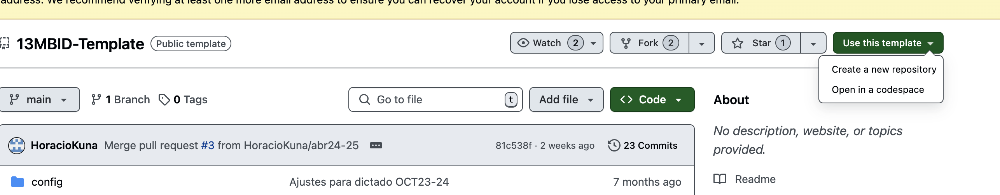

Actividad Práctica 1 - Entrega
Presentación de la Actividad Práctica I
Se deberá subir el resultado del desarrollo de la AP1 (informe -formato pdf- y libreta/s Jupyter -formato ipyn- que fueran modificadas o extendidas).
El informe será construido a partir de la plantilla generada a tal efecto y disponible en el compendio de materiales.

Criterios de evaluación:
Formato (10%)
Completitud de los requerimientos (40%)
Adecuado uso de las herramientas (40%)
Integración de elementos extra en las acciones requeridas (10%)


Iniciar sesion en github y hacer un fork del repositorio de la materia.

Guía de trabajo [Guia](13MBID-ABR24-25-AnexoSP1.pdf)

1. Explicar el spring cero

Replicación de ambientes para que todos usen las mismas librerías.

2. Requisitos

* Cuenta en Github
* Git instalado localmente
* Entorno VSC
* Paquete de ofimatica
* Lenguaje python instalado.


3. Usando el template entregado, crear un nuevo repositorio 

https://github.com/HoracioKuna/13MBID-Template



4. Explicar que contiene el repositorio, siguiendo el readme

5. Explicar como funciona git, copia remota y copia local

6. Clonar el repositorio en local, explicar las diferentes opciones

```bash
git clone 
```
Listar los directorios, y ver que se genera una nueva carpeta.

7. Instalar pluging: Jupyter, Python, Python Environment Management.


8. Replicar el entorno, archivos yaml de dependencias.
Para ello, conda o miniconda, o pip | virtual env.

Usar pip

Primero crear el archivo de requerimientos ejecutando:
```bash
./crear_archivo_requerimientos.bat
```

El Makefile es para linux y mac

9. Usando el mismo IDE instalar las dependencias generadas en el archivo de requerimientos.

(Ctrl + shift + p) Ver --> Paleta de comandos --> Python --> Crear entorno virtual --> Seleccionar el entorno creado.


10. Probar el entorno abriendo el archivo examples/probar-entorno.ipynb 

Una vez abierto en la parte superior derecha, seleccionar Select kernel y seleccionar el entorno creado.

Ejecutarlo dando clic en ejecutar.

### Ejecución de ejemplos

dvc: gestionado de versiones de datos

Explicar porque subir los datos a un repositorio de git no es eficiente. Ya que si los datos incrementan de tamaño, el repositorio de git se vuelve muy pesado.
Por lo que se trata de buscar una solución para almacenar y versionar los datos.
DVC nos ayuda a vincular los datos con el repositorio de git, asi pues cuando hagamos un cambio podamos ir guardando versiones de los datos (los cambios de todos los archivos).

examples/dvc.md

* Ya lo tenemos instalado.
* Ejecutando el comando `dvc init`, inicia un repositorio de datos dvc.

* Vamos a copiar los documentos `datos_creditos.csv` `datostarjetas.csv` en `data/row`, los documentos se encuentran en Recursos y materiales ==> Recursos del profesor --> actividades practicas y datos.


* Entonces agregar al control de versiones dvc

```
dvc add datos_creditos.csv
```
Explicar los mensajes de la herramienta.

Necesidad de ejecutar este comando.
```
git add .gitignore datos_creditos.csv.dvc datostaarjetas.csv.dvc
```

Ese archivo que genera .dvc es el que se va a subir a git, no los datos en si.

Esto me va a permitir moverme entre versiones.

* Despues ir a Git.md y explicar como se suben los archivos a git.


* Mostrar como el IDE permite ver los cambios en los archivos, y hacer los mismos cambios que los comandos (Boton control de cambios).

Explicar stage --> comando confirmado.

Botón de sync cambios (va a hacer push en github)

Mostrar como en el repositorio se agregan los archivos en github.

### Configurar storage remoto

* Podemos usar opcones de la nube y locales.
```
desde la raiz
Crear carpeta ./storage

# Nosotros vamos a poner en una ubicación local, aunque hay opciones remotas.

dvc remote add -d storage .storage

# Para subir los archivos debo ejecutar un comando mas que es

dvc push
```
### Desde ahora se vaya ubicar los archivos que vaya versionandp.


Agregar en el gitignore la carpeta .storage, para evitar que los archivos se suban a git.

Como hice un cambio debo sincronizar esos cambios.

### Ejercicio de que se borro datos de un archivo.

* Entrar al archivo y borar una cantidad de filas.

Uno podria pensar que ya perdi los datos. O que este en una instancia más avanzada y no pueda volver a tener el archivo que ya tenía generado.

Usar algo como dvc me va a ayudar.

Ver examples/ejemplo-dvc.md

* Actualizar la columna importe por importe_solicitado

```
git checkout [version][nombre del archivo]

# Ejemplo:
git checkout HEAD~1 data/row/datos_creditos.csv.dvc. # Me recupera este archivo
dvc checkout 


HEAD~1 es el commit anterior.


# o
dvc checkout --force
```
Podemos evidenciar como podemos ir recuperando datos en caso de que se modifiquen sin querer.
La libraria dvc es la que va cambianado los archivos. Nosotros solo interactuamos con dvc.


### Ejemplo Gestion de versiones de modelos y resultados de experimentación.
*mlflow*. Herramienta que nos permite gestionar los modelos y los resultados de experimentación.

Experimentación es parte del día del día.
Comparar los métodos, algoritmos.

Si bien las libretas de jupiter es un estandar para la experimentación, no es el mejor para la gestión de los modelos.
Hacer la comparación se vuelve complicado.

**mlflow**  nos asiste generando documentación sobre la experimentación.

Ver documentación de la herramienta.

Una posibilidad generar modelos.

Ver archivo examples/mlflow.md, tambien examples/ejemplos-mlflow.ipynb


Despues de ejecutar (los 4 primeros bloques de código), notar que se crea una carpeta mlflows dentro de examples.

```cd examples
mlflow ui
```
Ir ahi en la consola y ejecutar el comando `mlflow ui`

Notar como se han generado los resultados de la experimentación.


Luego volver al codigo, y ejecutar "Kameans - K-=2"

Luego tambien el "Kmeans - K=3"

Luego actualizar la interfaz de mlflow y ver como se han generado los resultados.

Vemos dentro de cada experimento, los resultados de la experimentación y parametros.

De ahi se podria comprar los valores de diferentes experimentos.

A simple vista uno pueda comparar los resultados.


Notas: Tener claro que esta es una propuesta de entorno tecnologico, pero no es un estándar.

Es un Spring cero, que se puede ir adaptando a las necesidades de cada uno.

1. La importancia del entorno tecnológico.
